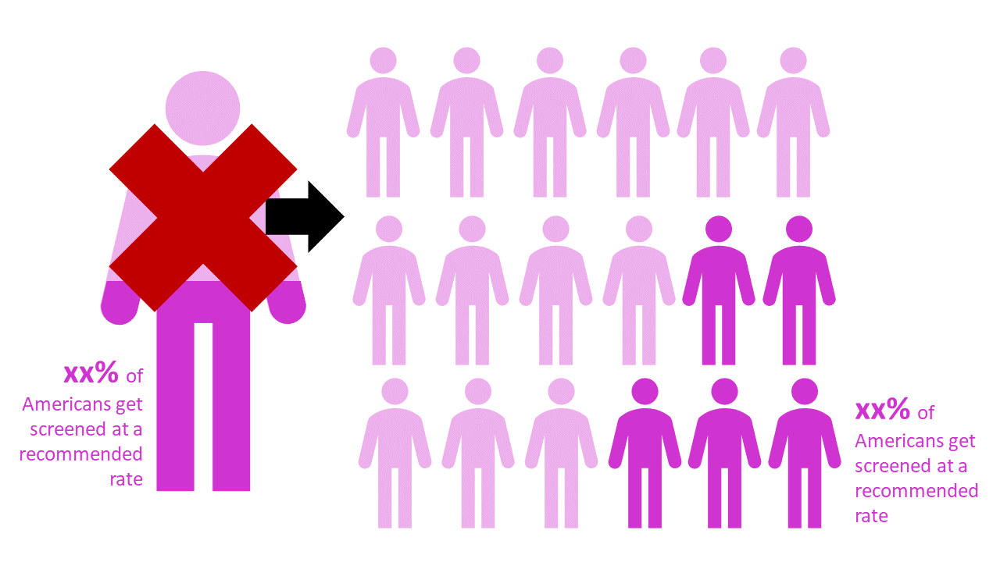
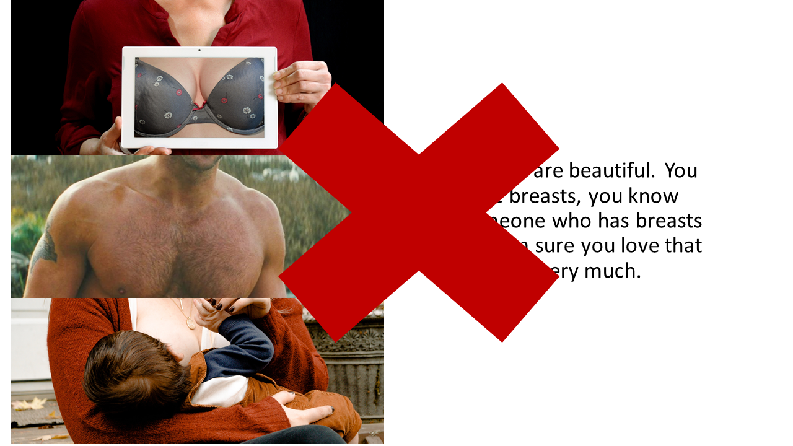

# Part Two

# Wireframes 
From my part one submission, I worked created actual sketches of my datavizulizations, rather than just putting in a placeholder for a bar graph. I also explored with color and mood photos for this presentation. 
Here is my updated storyboad I used for my user feedback rounds.

<object data="https://www.docdroid.net/Omm22tV/userfeedback.pdf" type="application/pdf" width="900px" height="700px">
    <embed src="https://www.docdroid.net/Omm22tV/userfeedback.pdf">
        
This browser does not support PDFs. Please download the PDF to view it: <a href="https://www.docdroid.net/pGSFWHF/wireframe.pdf">Download PDF</a>.

    </embed>
</object>

# User Research Protocol 

## Target Audience you hope to reach. 
My goal is to target young individuals passionate about the improvement of healthcare.   

## Approach to indentifying individuals to interview 
Approach individuals who are working in healthcare or aligning themselves to enter the healcare industry. 

## Interview Script 

Hello! My name is Deja and I'm creating a short interactive document about patient desired improvements in breast imaging. I currently have a powerpoint presentation, however this is just a wireframe for a scrollable interactive site such as this. *Display an example Shorthand site* Is now a bad time to speak about possible improvements I could make in this presentation?

Thank you, per slide, I will ask you three questions and at the end we will have two wrap up questions.

Per Slide: 
> Is anything causing confusion on this slide?
> What questions do you have? How might I address them on this slide?
> Is the data vizulation aestheticly pleaseing? 

After Entire Presentation: 
> What is missing from this presentation? 
> Who do you think this site is for? 
> Any other remarks? 

## Interview Findings

A: Female, 25, Speciality: Brain Imaging, Research Adolecent Mental Health, Card Carring Feminist

B: Male, 25, Speciality: Brain Imaging, Biomedical Research.

C: Female, 23, Speciality: CMU Biomedical Graduate Student. 

Insert all that shit in here

# Revised wireframes

An overall comment I found was that I was using inclusive terms, such as female identifying/assigned female at birth- however I've neglected to use sources that actually included transgender individuals. To solve this, I've found a few articles relating to this population and intend to use them in my final presentation. 

My additional refrences that will be included: 
>Incident of breast cancer in a cohort of 5,135 transgender veterans
> Breast Care in the Transgender Individual
> Breast Imaging in the Transgender Patient 

All my partifipants were unhappy with the screening rate slide, displaying a person icon. I've modified it to something like this:

	

	

'Less visable barriers' will be changed to 'less considered barriers' 

	

My Introduction Photots were distracting and confused to a few of my interviewers, so they've been modified. 

[BACK TO HOME](/README.md)
