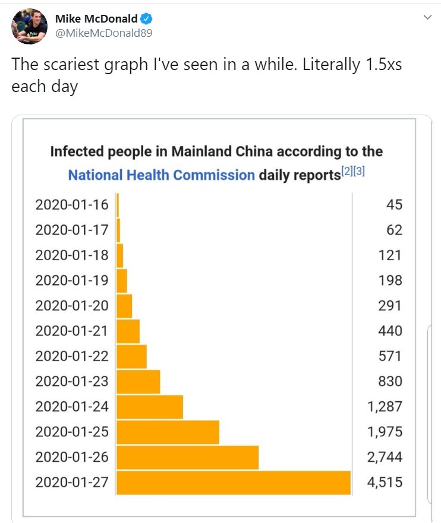
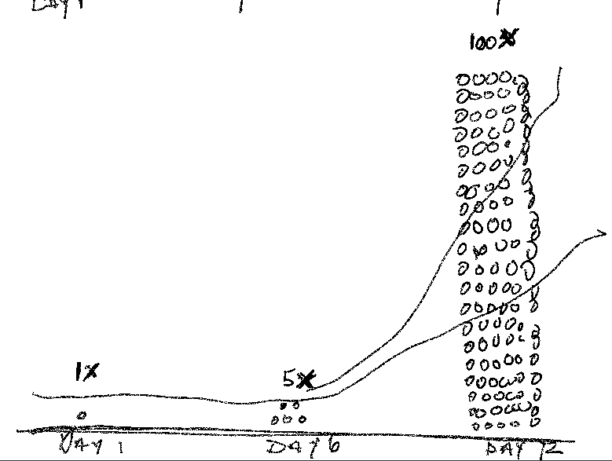
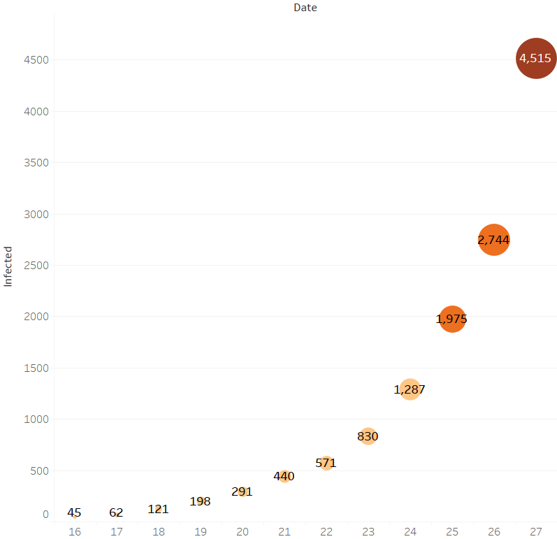

# Critique By Design, Data Viz Assignment

## Here's the orginal graph I found that I didn't think was reaching its full graph potiential:

The day I found this graph, our professor was speaking on how important it was to design with the common user in mind. Taking into consideration how we usually view time and how the typical western audience would read the graph from left to right. This chart was jarring at second look to see how the creater delt with time. Here, the creator has time passing vertically, rather than what is typically observed horizontally. This creates a pleasing shape to look at, however it hard to understand that time is passing for a user. I ofen view bar graphs as discrete categorical data, rather than one that deals with time. I imaged that this chart would be more clear if it was in a format that better supported the passing of time. 

## Inital Sketches  

I started off by creating large circles with an attempt to display the growth rate of the cases in a medium that appreciated time. I explored these concepts with only three data points so the user would be able to easily distinguish the growth between each time period. 

I then explored adding case values on the y axis, so the circle's position would also display the growing number of cases. 

To shift gears, I tried to create a bar graph with round circles dipicting a potion of the cases connected to a specific date. I added a multiplier for each day so the user would be able to quickly estimate growth. I was unhappy with this version, and could not find a digital sketching service that would support the creation of this graph.

I finally went digital, and started exploring my circle concepts with Tableau. I created my growing circle graphs with dramatic white space and overlapping values to show how much larger the value had gotten over the passing of 12 days. I showed Sketch 3 to passersby and the original graph. People did not like the jarring white space to the left of the graph, but understood it's intention was to display groth. Respondents agrees with the color selection, and appreciated the values placed within the bubble. Respondents did not like the overlapping bubbles at the end of the spectrum.  

In response, I added an axis for the cases to get rid of the unbalanced white space and overlapping value. I showed this to respondents and they mentioned it was clearer than the previos sketch. However, respondents did not like the text covering the bubble. I took a break from editing graphs, and did my weekly readings. After reading chapters 3 & 4 of Good Graphs, I realized I was using color inccorectly in this graph. Distinguishing between size and shape deminishes clarity for a graph.

At this point, I went off digital and sketched a simple line graph that could clearly convey the information without other distracting features. 

I focused on creafting a clear title that was specific to the infomation I decided to highlight. I went to datawrapper to finish this graph because it was much simplier than the prior sketches. 

# Final Graph Redesign 

<iframe title="Coronavirus Infection, 100 fold Increase in 12 Days" aria-label="Interactive line chart" id="datawrapper-chart-X4aBG" src="//datawrapper.dwcdn.net/X4aBG/1/" scrolling="no" frameborder="0" style="width: 0; min-width: 100% !important; border: none;" height="400"></iframe>

[BACK TO HOME](/README.md)
